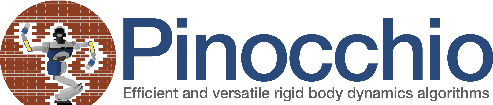
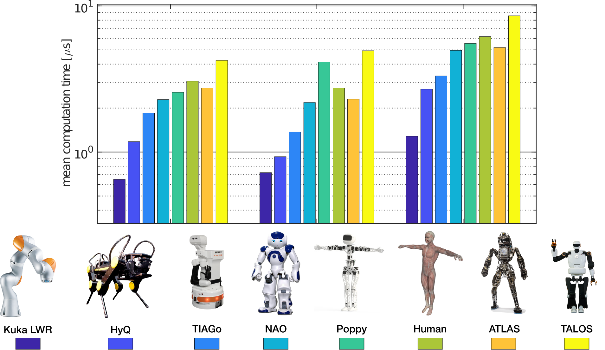

<p align="center">
  
</p>

<p align="center">
  <a href="https://opensource.org/licenses/BSD-2-Clause"></a>
  <a href="https://travis-ci.org/stack-of-tasks/pinocchio"></a>
  <a href="http://projects.laas.fr/gepetto/doc/stack-of-tasks/pinocchio/master/coverage/"></a>
  <a href="https://anaconda.org/conda-forge/pinocchio"></a>
  <a href="https://anaconda.org/conda-forge/pinocchio"></a>
  <a href="https://conda.anaconda.org/conda-forge"></a>
</p>

<!--Pinocchio: a C++ library for efficient Rigid Multi-body Dynamics computations
===========
-->

**Pinocchio** instantiates the state-of-the-art Rigid Body Algorithms for poly-articulated systems based on revisited Roy Featherstone's algorithms.
Besides, **Pinocchio** provides the analytical derivatives of the main Rigid-Body Algorithms like the Recursive Newton-Euler Algorithm or the Articulated-Body Algorithm.

**Pinocchio** is first tailored for robotics applications, but it can be used in extra contexts (biomechanics, computer graphics, vision, etc.).
It is built upon Eigen for linear algebra and FCL for collision detection. **Pinocchio** comes with a Python interface for fast code prototyping, [directly accessible](https://github.com/conda-forge/pinocchio-feedstock#installing-pinocchio) through [Conda](https://docs.conda.io/en/latest/).

**Pinocchio** is now at the heart of various robotics softwares as [Crocoddyl](https://github.com/loco-3d/crocoddyl/tree/devel), an open-source and efficient Differential Dynamic Programming solver for robotics, the [Stack-of-Tasks](http://stack-of-tasks.github.io), an open-source and versatile hierarchical controller framework or the [Humanoid Path Planner](https://humanoid-path-planner.github.io/hpp-doc), an open-source software for Motion and Manipulation Planning. 

If you want to learn more on **Pinocchio** internal behaviors and main features, we invite you to read the related [paper](https://hal-laas.archives-ouvertes.fr/hal-01866228).

If you want to directly dive into **Pinocchio**, only one single line is sufficient (assuming you have Conda):

<p align="center">
conda install pinocchio -c conda-forge
</p>

## News

**August 2020**: We are **hiring**! We are looking for a talented C++/Python software developer to enhance and promote Pinocchio inside the robotics community and beyond. Please contact @jcarpent for further details.

## Pinocchio main features

**Pinocchio** is fast:

   - C++ template library,
   - cache friendly,
   - automatic code generation support.

**Pinocchio** is versatile, implementing basic and more advanced rigid body dynamics algorithms:

   - forward kinematics and its analytical derivatives,
   - forward/inverse dynamics and their analytical derivatives,
   - centroidal dynamics and its analytical derivatives,
   - support of multiple precision arithmetic via Boost.Multiprecision or any similar framework,
   - and much more with the support of modern Automatic Differentiation frameworks like [CppAD](https://github.com/coin-or/CppAD) or [CasADi](https://web.casadi.org/).

**Pinocchio** is flexible:

   - header only,
   - C++ 98/03/11/14/17/20 compliant.

**Pinocchio** is extensible.  
**Pinocchio** is multi-thread friendly.  
**Pinocchio** is reliable and extensively tested (unit-tests, simulations and real robotics applications).  
**Pinocchio** is supported and tested on Windows, Mac OS X, Unix and Linux ([see build status here](http://robotpkg.openrobots.org/rbulk/robotpkg/math/pinocchio/index.html)).

## Performances

**Pinocchio** exploits at best the sparsity induced by the kinematic tree of robotics systems. Thanks to modern programming language paradigms, **Pinocchio** is able to unroll most of the computations directly at compile time, allowing to achieve impressive performances for a large range of robots, as illustrated by the plot below, obtained on a standard laptop equipped with an Intel Core i7 CPU @ 2.4 GHz.

<p align="center">
  
</p>

For other benchmarks, and mainly the capacity of Pinocchio to exploit at best your CPU capacities using advanced code generation techniques, we refer to the technical [paper](https://hal-laas.archives-ouvertes.fr/hal-01866228).
In addition, the introspection done [here](https://github.com/rbd-benchmarks/rbd-benchmarks) may also help you to understand and compare the performances of the modern rigid body dynamics librairies.

## Ongoing developments

If you want to follow the current developments, you can directly refer to the [devel branch](https://github.com/stack-of-tasks/pinocchio/tree/devel).
The [master branch](https://github.com/stack-of-tasks/pinocchio/tree/master/) only contains latest release. Any new Pull Request should then be submitted on the [devel branch](https://github.com/stack-of-tasks/pinocchio/tree/devel/).

## Installation

**Pinocchio** can be easily installed on various Linux (Ubuntu, Fedora, etc.) and Unix distributions (Mac OS X, BSD, etc.). Please refer to the [installation procedure](http://stack-of-tasks.github.io/pinocchio/download.html).

If you only need the Python bindings of Pinocchio, you may prefer to install it through [Conda](https://docs.conda.io/en/latest/). Please follow the procedure described [here](https://github.com/conda-forge/pinocchio-feedstock#installing-pinocchio).

**Pinocchio** is also deployed on ROS, you may follow its deployment status on [Melodic](https://index.ros.org/r/pinocchio/#melodic) or [Kinetic](https://index.ros.org/r/pinocchio/#kinetic).

## Documentation

The online **Pinocchio** documentation of the last release is available [here](https://gepettoweb.laas.fr/doc/stack-of-tasks/pinocchio/master/doxygen-html/).

## Examples

We provide some basic examples on how to use **Pinocchio** in Python in the [examples/python](./examples/python) directory.
Additional examples introducing **Pinocchio** are also available in the [documentation](https://gepettoweb.laas.fr/doc/stack-of-tasks/pinocchio/master/doxygen-html/md_doc_d-practical-exercises_intro.html)

## Tutorials

**Pinocchio** comes with a large bunch of tutorials aiming at introducing the basic tools for robotics control.
The content of the tutorials is described [here](https://gepettoweb.laas.fr/doc/stack-of-tasks/pinocchio/master/doxygen-html/md_doc_d-practical-exercises_1-directgeom.html).

## Visualization

**Pinocchio** provides support for many open-source and free visualizers:

- [Gepetto Viewer](https://github.com/Gepetto/gepetto-viewer): a C++ viewer based on [OpenSceneGraph](https://github.com/openscenegraph/OpenSceneGraph) with Python bindings and Blender export. See [here](https://github.com/stack-of-tasks/pinocchio-gepetto-viewer) for a C++ example on mixing **Pinocchio** and **Gepetto Viewer**.
- [Meshcat](https://github.com/rdeits/meshcat): supporting visualization in Python and which can be embeded inside any browser.
- [Panda3d](https://github.com/ikalevatykh/panda3d_viewer): supporting visualization in Python and which can be embeded inside any browser.

Many external viewers can also be integrated. See example [here](./bindings/python/pinocchio/visualize/base_visualizer.py) for more information.

## Citing Pinocchio

To cite **Pinocchio** in your academic research, please use the following bibtex lines:
```
@misc{pinocchioweb,
   author = {Justin Carpentier and Florian Valenza and Nicolas Mansard and others},
   title = {Pinocchio: fast forward and inverse dynamics for poly-articulated systems},
   howpublished = {https://stack-of-tasks.github.io/pinocchio},
   year = {2015--2019}
}
```
and the following one for the reference to the paper introducing **Pinocchio**:
```
@inproceedings{carpentier2019pinocchio,
   title={The Pinocchio C++ library -- A fast and flexible implementation of rigid body dynamics algorithms and their analytical derivatives},
   author={Carpentier, Justin and Saurel, Guilhem and Buondonno, Gabriele and Mirabel, Joseph and Lamiraux, Florent and Stasse, Olivier and Mansard, Nicolas},
   booktitle={IEEE International Symposium on System Integrations (SII)},
   year={2019}
}
```

The algorithms for the analytical derivatives of rigid-body dynamics algorithms are detailed here:
```
@inproceedings{carpentier2018analytical,
  title = {Analytical Derivatives of Rigid Body Dynamics Algorithms},
  author = {Carpentier, Justin and Mansard, Nicolas},
  booktitle = {Robotics: Science and Systems},
  year = {2018}
}
```

## Questions and Issues

You have a question or an issue? You may either directly open a [new issue](https://github.com/stack-of-tasks/pinocchio/issues) or use the mailing list <pinocchio@laas.fr>.

## Credits

The following people have been involved in the development of **Pinocchio** and are warmly thanked for their contributions:

- [Justin Carpentier](https://jcarpent.github.io) (Inria): main developer and manager of the project
- [Nicolas Mansard](http://projects.laas.fr/gepetto/index.php/Members/NicolasMansard) (LAAS-CNRS): initial project instructor
- [Guilhem Saurel](http://projects.laas.fr/gepetto/index.php/Members/GuilhemSaurel) (LAAS-CNRS): continuous integration and deployment
- [Joseph Mirabel](http://jmirabel.github.io/) (LAAS-CNRS): Lie groups support
- [Antonio El Khoury](https://www.linkedin.com/in/antonioelkhoury) (Wandercraft): bug fixes
- [Gabriele Buondono](http://projects.laas.fr/gepetto/index.php/Members/GabrieleBuondonno) (LAAS-CNRS): features extension, bug fixes and Python bindings
- [Florian Valenza](https://fr.linkedin.com/in/florian-valenza-1b274082) (Astek): core developments and FCL support
- [Wolfgang Merkt](http://www.wolfgangmerkt.com/) (University of Edinburgh): ROS integration and support
- [Rohan Budhiraja](https://scholar.google.com/citations?user=NW9Io9AAAAAJ) (LAAS-CNRS): features extension
- [Loïc Estève](https://github.com/lesteve) (Inria): Conda integration and support
- [Igor Kalevatykh](https://github.com/ikalevatykh) (Inria): Panda3d viewer support
- [Matthieu Vigne](https://github.com/matthieuvigne) (Wandercraft): MeshCat viewer support
- [Robin Strudel](https://www.di.ens.fr/robin.strudel/) (Inria): features extension
- [François Keith](https://scholar.google.fr/citations?user=cxSxXiQAAAAJ&hl=en) (CEA): Windows support
- [Aamr El Kazdadi](https://github.com/aelkazdadi) (Inria): multiprecision arithmetic support

If you have taken part to the development of **Pinocchio**, feel free to add your name and contribution in this list.

## Acknowledgments

The development of **Pinocchio** is actively supported by the [Gepetto team](http://projects.laas.fr/gepetto/) [@LAAS-CNRS](http://www.laas.fr) and the [Willow team](https://www.di.ens.fr/willow/) [@INRIA](http://www.inria.fr).
